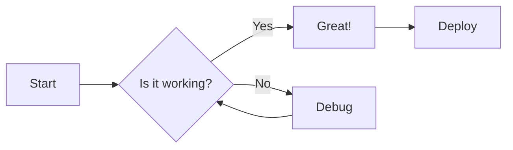
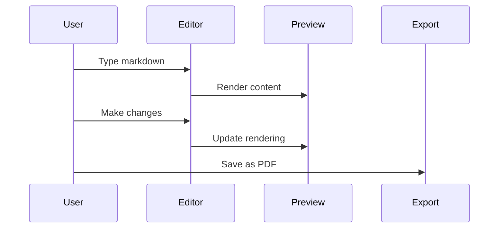

https://markdownviewer.pages.dev/


# Koordinat Titik, Jarak, Vektor, dan Garis. 
## 1. Koordinat Titik di Ruang
Untuk menentukan lokasi suatu titik pada bidang datar, diperlukan dua angka. Kita tahu bahwa setiap titik pada bidang datar dapat direpresentasikan sebagai pasangan terurut bilangan real (a, b), a adalah koordinat x dan b adalah koordinat y. Karena alasan ini, bidang datar disebut dua dimensi. Sedangkan, untuk menentukan lokasi suatu titik di ruang, diperlukan tiga angka. Kita merepresentasikan setiap titik di ruang dengan tiga bilangan real yang terurut (a, b, c). 
* Bidang (2D): Memerlukan 2 angka (x, y) untuk menentukan posisi.
* Bidang (3D): Memerlukan 3 angka (x, y, z) untuk menentukan posisi.

Komponen dasar sistem koordinat:
* Titik asal (O): Titik acuan (0, 0, 0)
* Sumbu koordinat: Tiga garis berarah (x, y, z) yang saling tegak lurus
* Aturan tangan kanan: Cara menentukan arah sumbu z positif (ibu jari menunjuk ke arah sumbu z positif saat jari tangan kanan melengkung dari x ke y)

Bidang dan Oktan:
* Tiga bidang koordinat:
 
   1. Bidang xy (di mana z = 0)
   2. Bidang yz (di mana x = 0)
   3. Bidang xz (di mana y = 0)
* Oktan: Ruang dibagi menjadi 8 oktan oleh ketiga bidang tersebut

Menentukan titik P(a, b, c):

* Mulai dari titik asal (0, 0, 0)
* Berjalan a satuan sepanjang sumbu x
* Berjalan b satuan sejajar sumbu y
* Berjalan c satuan sejajar sumbu z

Proyeksi titik

Setiap titik P(a, b, c) membentuk "kotak persegi panjang" di ruang.
* Proyeksi adalah bayangan titik pada bidang:

  1. Q(a, b, 0) → Proyeksi pada bidang xy.
  2. R(0, b, c) → Proyeksi pada bidang yz.
  3. S(a, 0, c) → Proyeksi pada bidang xz.

Contoh soal:

Misalkan posisi awal berada di titik asal (0, 0, 0). Anda bergerak sejauh 4 satuan sepanjang sumbu x positif, lalu bergerak sejauh 3 satuan ke arah bawah (sejajar sumbu z negatif). Tentukan koordinat posisi akhir Anda.

Penyelesaian:

[Titik ruang](D:\kuliah uny\tugas\geometri\kelompok 1\ titik ruang.jpg)

* Titik awal (0, 0, 0) 

* Bergerak sejauh 4 satuan sepanjang sumbu x positif (4, 0, 0)

* Bergerak sejauh 3 satuan ke arah bawah (sejajar sumbu z negarif) (4, 0, -3)

* Jadi, titik akhir berada di (4, 0, -3)


## 2. Jarak Antara Dua Titik

## 3. Vektor dalam Ruang
   1. Definisi Vektor dalam Ruang
Vektor dalam ruang adalah besaran yang memiliki nilai dan arah yang terletak di dalam ruang tiga dimensi. Setiap vektor dapat dinyatakan dalam koordinat kartesius menggunakan tiga sumbu yang saling tegak lurus, yaitu sumbu x, sumbu y, dan sumbu z.

Notasi vektor:
* Komponen:  v = (v1, v2, v3)
* Vektor Satuan:  v =v1i+v2j+v3k
Dimana i, j, k  adalah vektor basis pada sumbu x, y,z)

 2. Operasi Dasar Vektor

      Jika diketahui a = (a1, a2, a3) dan b = (b1, b2, b3) , maka:
* Penjumlahan dan Pengurangan
Dilakukan dengan menjumlahkan atau mengurangkan komponen yang bersesuaian.
a b = (a1b1,a2b2,a3b3)

* Perkalian Skalar
Jika k adalah sebuah skalar, maka:
 ka =(ka1, ka2, ka3)
* Panjang Vektor
Jarak dari titik pangkal ke titik ujung vektor:
a =a12+a22+a32

 3. Perkalian Dua Vektor
Ada dua jenis perkalian utama dalam R3:

* Dot Product (Perkalian Titik)

   Hasil dari perkalian titik adalah sebuah skalar. Digunakan untuk mencari sudut atau proyeksi.
  Rumus Komponen: a b =a1b1+a2b2+a3b3> Rumus Sudut: a b =a b cos 

   Sifat: a .b =a b sin  (Luas jajar genjang yang dibentuk kedua vektor).


* Cross Product (Perkalian Silang)
Hasil dari perkalian silang adalah sebuah vektor yang tegak lurus terhadap bidang yang dibentuk a dan b .

 
 4. Aplikasi Vektor dalam Ruang

* Vektor Posisi: Menentukan letak titik P(x,y,z) relatif terhadap titik asal O(0,0,0).
* Proyeksi Ortogonal: Mencari bayangan satu vektor pada arah vektor lainnya.
* Persamaan Garis dan Bidang: Digunakan dalam kalkulus peubah banyak untuk menentukan geometri ruang.

 5. Contoh Soal dan Penyelesaiannya:


## 4. Garis dalam Ruang


# Welcome to Markdown Viewer

## ✨ Key Features
- **Live Preview** with GitHub styling
- **Smart Import/Export** (MD, HTML, PDF)
- **Mermaid Diagrams** for visual documentation
- **LaTeX Math Support** for scientific notation
- **Emoji Support** 😄 👍 🎉

## 💻 Code with Syntax Highlighting
```javascript
  function renderMarkdown() {
    const markdown = markdownEditor.value;
    const html = marked.parse(markdown);
    const sanitizedHtml = DOMPurify.sanitize(html);
    markdownPreview.innerHTML = sanitizedHtml;
    
    // Syntax highlighting is handled automatically
    // during the parsing phase by the marked renderer.
    // Themes are applied instantly via CSS variables.
  }
```

## 🧮 Mathematical Expressions
Write complex formulas with LaTeX syntax:

Inline equation: $$E = mc^2$$

Display equations:
$$\frac{\partial f}{\partial x} = \lim_{h \to 0} \frac{f(x+h) - f(x)}{h}$$

$$\sum_{i=1}^{n} i^2 = \frac{n(n+1)(2n+1)}{6}$$

## 📊 Mermaid Diagrams
Create powerful visualizations directly in markdown:



### Sequence Diagram Example


## 📋 Task Management
- [x] Create responsive layout
- [x] Implement live preview with GitHub styling
- [x] Add syntax highlighting for code blocks
- [x] Support math expressions with LaTeX
- [x] Enable mermaid diagrams

## 🆚 Feature Comparison

| Feature                  | Markdown Viewer (Ours) | Other Markdown Editors  |
|:-------------------------|:----------------------:|:-----------------------:|
| Live Preview             | ✅ GitHub-Styled       | ✅                     |
| Sync Scrolling           | ✅ Two-way             | 🔄 Partial/None        |
| Mermaid Support          | ✅                     | ❌/Limited             |
| LaTeX Math Rendering     | ✅                     | ❌/Limited             |

### 📝 Multi-row Headers Support

<table>
  <thead>
    <tr>
      <th rowspan="2">Document Type</th>
      <th colspan="2">Support</th>
    </tr>
    <tr>
      <th>Markdown Viewer (Ours)</th>
      <th>Other Markdown Editors</th>
    </tr>
  </thead>
  <tbody>
    <tr>
      <td>Technical Docs</td>
      <td>Full + Diagrams</td>
      <td>Limited/Basic</td>
    </tr>
    <tr>
      <td>Research Notes</td>
      <td>Full + Math</td>
      <td>Partial</td>
    </tr>
    <tr>
      <td>Developer Guides</td>
      <td>Full + Export Options</td>
      <td>Basic</td>
    </tr>
  </tbody>
</table>

## 📝 Text Formatting Examples

### Text Formatting

Text can be formatted in various ways for ~~strikethrough~~, **bold**, *italic*, or ***bold italic***.

For highlighting important information, use <mark>highlighted text</mark> or add <u>underlines</u> where appropriate.

### Superscript and Subscript

Chemical formulas: H<sub>2</sub>O, CO<sub>2</sub>  
Mathematical notation: x<sup>2</sup>, e<sup>iπ</sup>

### Keyboard Keys

Press <kbd>Ctrl</kbd> + <kbd>B</kbd> for bold text.

### Abbreviations

<abbr title="Graphical User Interface">GUI</abbr>  
<abbr title="Application Programming Interface">API</abbr>

### Text Alignment

<div style="text-align: center">
Centered text for headings or important notices
</div>

<div style="text-align: right">
Right-aligned text (for dates, signatures, etc.)
</div>

### **Lists**

Create bullet points:
* Item 1
* Item 2
  * Nested item
    * Nested further

### **Links and Images**

Add a [link](https://github.com/ThisIs-Developer/Markdown-Viewer) to important resources.

Embed an image:


### **Blockquotes**

Quote someone famous:
> "The best way to predict the future is to invent it." - Alan Kay

---

## 🛡️ Security Note

This is a fully client-side application. Your content never leaves your browser and stays secure on your device.
